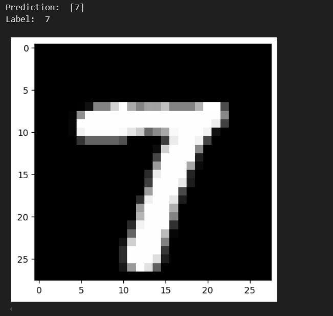

# IMAGE CLASSIFICATION WITH NUMPY
  We are here again to make understandable the image processing and computer vision which is subset of AI for all AI interested parties. 
  Today, we have an example including dataset and notebook about how to build a neural network system to classify images from scracth without using pytorch, tensorflow-keras, yolo, etc.
  If you are more interested about it you may also visit our youtube videos where we explain how to code this system from scratch.
  
  
  
  
  📺 **YouTube'daki tam eğitim videosunu izleyin:** [YouTube Linki](https://www.youtube.com/watch?v=u9SMgh-NV6s)

